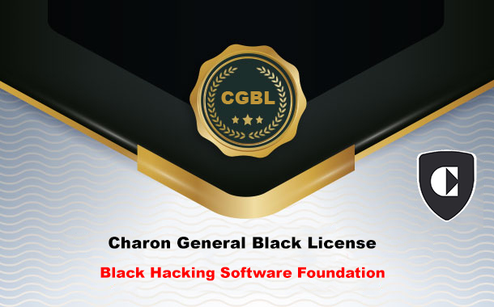

<h1 align="center">
  
  <br>
  Charon General Black License
  
  <!-- [](https://Ch4120N.github.io/CGBL) -->
</h1>

Charon General Black License is a license based on supporting the production of hacking tools. You can use this license to make your own tools. By using this license, you have actually supported the Charon team, and our support means help in your project and special advice for your product.

The terms of the license are:

* The software provided under our license does not have the right to use other licenses.

* Your production should aim to increase the level of security and any criminal purpose will cause us to not support you.

* Your software code must be provided as an open source project.

How to put a license in your software or product:

```licence
Product Name  Ver 1.0 Copyright < Year>  <Name Of Author>  
This Program Is Free Software: You Can Redistribute It And/Or Modify 
It Under The Terms Of The  Charon General Black License  As Published By
The  Black Hacking Software Foundation , Either Version 1/2 Of The License.
This Program Is Distributed In The Hope That It Will Be Useful,
But Without Any Warranty .  See The
Charon General Black License For More Details.
You Should Have Received A Copy Of The  Charon General Black License
Along With This Program.  If Not, See < http://Ch4120N.github.io/CGBL/>
```
