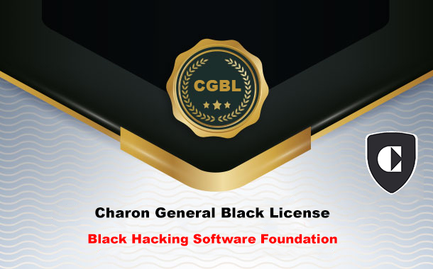

<h1 align="center">
  
  <br>
  Charon General Black License
  
  <!-- [](https://Ch4120N.github.io/CGBL) -->
</h1>

<!-- Charon General Black License is a license based on supporting the production of hacking tools. You can use this license to make your own tools. By using this license, you have actually supported the Charon team, and our support means help in your project and special advice for your product.

The terms of the license are:

* The software provided under our license does not have the right to use other licenses.

* Your production should aim to increase the level of security and any criminal purpose will cause us to not support you.

* Your software code must be provided as an open source project.

How to put a license in your software or product:

```licence
Product Name  Ver 1.0 Copyright < Year>  <Name Of Author>  
This Program Is Free Software: You Can Redistribute It And/Or Modify 
It Under The Terms Of The  Charon General Black License  As Published By
The  Black Hacking Software Foundation , Either Version 1/2 Of The License.
This Program Is Distributed In The Hope That It Will Be Useful,
But Without Any Warranty .  See The
Charon General Black License For More Details.
You Should Have Received A Copy Of The  Charon General Black License
Along With This Program.  If Not, See < http://Ch4120N.github.io/CGBL/>
``` -->
## Understanding the Charon General Black License

In the realm of cybersecurity and ethical hacking, the Charon General Black License (CGBL) stands out as a unique and powerful tool. This license is designed to support the development and production of hacking tools aimed at improving security. By using this license, developers can create their own tools while benefiting from the support and expertise of the Charon team. Let's delve into what this license entails and why it is significant.

---

## What is the Charon General Black License?

The Charon General Black License is a specialized license for software developers focused on creating hacking tools. The primary goal of this license is to foster the development of tools that can enhance security. When you opt for this license, you are essentially supporting the Charon team, and in return, they offer assistance with your project and provide specialized advice for your product.

---

## Key Terms of the License

The CGBL comes with specific terms and conditions designed to ensure that the tools developed are used ethically and contribute positively to the cybersecurity community.


### Exclusive Use of the License

Any software distributed under the CGBL cannot be licensed under Any other license simultaneously. This ensures that the software adheres strictly to the ethical guidelines and standards set by the Charon team. This exclusivity clause is crucial for maintaining the integrity and purpose of the tools developed under this license.


### Ethical Purpose

The tools and software developed under this license must aim to improve security. The Charon team will not support any project intended for criminal activities. This clause is vital as it underscores the ethical responsibility of developers to use their skills and tools for good. By focusing on enhancing security, the CGBL ensures that all efforts contribute to the betterment of digital safety.


### Open Source Requirement

All software code created under this license must be made available as an open-source project. This promotes transparency, collaboration, and continuous improvement, as other developers can review, use, and enhance the code. The open-source requirement also helps build a community of developers who can collectively work on improving the tools and sharing knowledge, ultimately leading to more robust security solutions.

---

## How to Apply the License to Your Software?

To use this license in different places such as: **Github**, you must create a new repository and then create a new file whose name must be License (my suggestion is to create the file without the extension). If you decide to use the Charon General Black license for your software or product, you must include the following statement in the License file or in any other document:


### Ethical and Legal Use License for Software

```plaintext

<Product Name> Copyright <Year> <Author Name>
This Program Is Free Software: You Can Redistribute It And/Or Modify It Under The Terms Of The Charon General Black License As Published By The Black Hacking Software Foundation.

Terms and Conditions for Copying, Distribution, and Modification:

Non-use of other licenses:
Software or tools distributed under the CGBL license cannot utilize other licenses.
This clause is designed to maintain integrity and consistency in the use of this license.

Permitted Use:
This software is designed solely for legal and ethical use.
Usage for educational purposes, legal penetration testing, and security evaluation is permitted.
Any unauthorized use, including illegal hacking, data theft, or unauthorized system intrusion, is prohibited.

Usage Conditions:
Users must ensure that all their activities comply with local, national, and international laws.
Users must obtain necessary permissions from system owners before conducting any penetration testing or related security activities.

User Responsibility:
Users are responsible for any use of the software and must report all their activities transparently and document them.
Users must not use the software to create, distribute, or execute malicious code (such as viruses, trojans, and malware).

Data Protection:
Users must comply with all data protection and privacy laws.
Users must not collect, store, or process personal or sensitive information without explicit permission from the owners.

Distribution of Modifications:
Any modifications or changes to this software must be distributed under the same original license and include all the terms and conditions of this license.
Users must fully document all changes and publish a copy of the documentation along with the modified software.

Developer Commitments:
The developer commits to providing the software with high ethical and legal standards and ensuring no intentional backdoors, vulnerabilities, or malicious features exist in the software.
The developer assumes no responsibility for misuse, illegal use, or unethical behavior by users; all responsibilities and liabilities rest with the users.
The developer reserves the right to update and amend the terms of this license at any time, with or without prior notice to users.

License Termination:
This license will automatically terminate if any of the above conditions are violated, and users must immediately cease using the software.
The developer reserves the right to block access to the software for users who violate the terms of the license at any time and without prior notice and may take legal action against such users.
Upon termination of the license, users must destroy all copies of the software in their possession and confirm in writing to the developer that this condition has been met.

Disclaimer of Warranty:
This software is provided "as is," without any express or implied warranty, including but not limited to warranties of merchantability, fitness for a particular purpose, and non-infringement.
The developer does not warrant that the software will meet users' requirements, that the operation of the software will be uninterrupted or error-free, or that any defects identified will be corrected.
Users assume all risks associated with the use of this software, including but not limited to risks of data loss, system damage, or any other adverse effects resulting from the use or misuse of the software.

Limitation of Liability:
In no event shall the developer be liable for any direct, indirect, incidental, special, exemplary, or consequential damages (including but not limited to loss of use, data, or profits) arising from or in connection with the use or performance of this software, whether in contract, tort, or otherwise, even if advised of the possibility of such damages.
The developer's total liability arising from or in connection with this license or the use of the software shall not exceed the amount paid by the user for the software, if any.

For more details, See <http://Ch4120N.github.io/CGBL>
```
---

## Why Choose the Charon General Black License?

Opting for the Charon General Black License offers several benefits:

### Support from the Charon Team

By choosing the CGBL, you gain access to expert advice and assistance from the Charon team. This support can be invaluable for the success of your project, providing guidance and specialized knowledge that can help you overcome technical challenges and optimize your tool’s effectiveness.


### Contribution to Security

Developing tools under the CGBL means you are actively contributing to a safer digital world. Your tools are designed to enhance security, protecting users and systems from malicious activities. This contribution is a significant step towards building a more secure and resilient internet infrastructure.


### Open Source Community

Releasing your code as open source fosters a collaborative environment where others can contribute to and benefit from your work. This community-driven approach not only improves the quality and security of the tools but also accelerates innovation by leveraging the collective expertise of the global developer community.


## Conclusion

The `Charon General Black License` is more than just a set of legal terms; it is a commitment to ethical hacking and the betterment of cybersecurity. By adhering to this license, developers can ensure that their tools are used for good, gain valuable support, and contribute to the global effort to enhance digital security. Whether you are an experienced developer or just starting, the `CGBL` provides a framework that encourages ethical practices and communit


If you're interested in learning more about the Charon General Black License and how it can benefit your projects, visit the [Charon General Black License page](https://ch4120n.github.io/CGBL/).